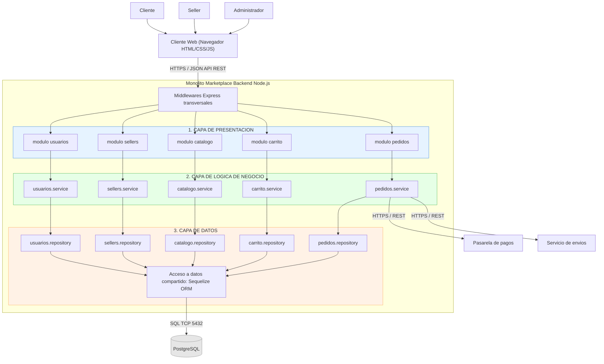

# Estilo Arquitectónico

**Selección:** Monolito modular + arquitectura en capas.

Se ha seleccionado un Monolito Modular organizado en capas. Esto permite que los módulos (Usuarios, Sellers, Catálogo, Carrito, Pedidos) mantengan sus responsabilidades separadas de forma lógica (Presentación, Lógica de Negocio, Datos), pero se desplieguen juntos como una única aplicación para facilitar la operación inicial.

## Diagrama de Arquitectura (Capas)

### Reglas de la arquitectura
1. Cada capa solo conoce a la capa inmediatamente inferior.
2. Un módulo no accede al repository ni a las tablas de otro módulo.
3. La comunicación entre módulos se hace llamando a su service.
4. Todo se ejecuta en un único proceso Node.js con una única BD.